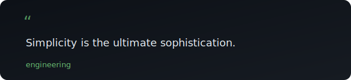

<p align="center">
  <a href="https://github.com/TrymSeb">
    
  </a>
</p>

<p align="center">
  <strong>Software engineer living in all unknown places.</strong>
</p>

<br/>

---

<br/>

<p align="center">
  
</p>

<br/>

---

<br/>

## Current Mission

Building **Tatzeroko** — an AI-native platform that makes developer tools feel invisible.

The goal is simple: remove friction from the development workflow using local AI, intelligent automation, and systems that adapt to how you work.

<br/>

## Focus

| Area | What |
|------|------|
| **Tatzeroko** | AI-native developer platform |
| **AI Infrastructure** | vLLM, LiteLLM, local inference |
| **Kubernetes** | Self-hosted cluster orchestration |
| **AI Agents** | Autonomous coding and workflow agents |
| **Open Source** | Tools that help other builders |

<br/>

## Featured Projects

<table>
  <tr>
    <td width="50%" valign="top">
      <h3><a href="https://github.com/tatzeroko">Tatzeroko</a></h3>
      <p>AI-native developer platform. Build, deploy, and iterate on software with intelligent automation that adapts to your workflow.</p>
      <p>
        <code>ai</code> <code>developer-tools</code> <code>automation</code>
      </p>
    </td>
    <td width="50%" valign="top">
      <h3><a href="https://github.com/TrymSeb?tab=repositories">More Projects</a></h3>
      <p>Exploring distributed systems, AI infrastructure, and developer experience. Always building something in the unknown places.</p>
      <p>
        <code>distributed-systems</code> <code>infrastructure</code> <code>oss</code>
      </p>
    </td>
  </tr>
</table>

<br/>

## Approach

```
Local-first AI  ·  Boring infrastructure  ·  Invisible tooling
```

I believe the best systems are the ones you forget are there. Build for the long term. Ship for today. Automate the boring parts. Focus on the interesting ones.

<br/>

---

<br/>

<p align="center">
  <a href="https://github.com/sponsors/TrymSeb">Sponsor</a> ·
  <a href="https://github.com/TrymSeb?tab=repositories">Repositories</a> ·
  <a href="https://github.com/TrymSeb?tab=repositories&type=source">Latest Work</a>
</p>

<br/>

<p align="center"><sub>Built with intention. Updated automatically.</sub></p>
